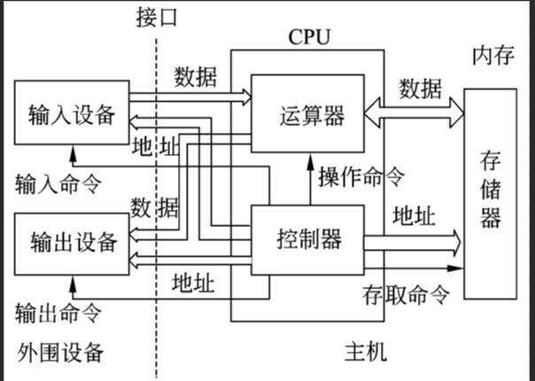

#   DancerInFarron队伍——OS文档总结 
> 说明：本项目是对华中科技大学同学所开发的xv6-k210[]进行的部分注释版，对于比赛来说由于时间和精力有限，小组开发的OS并没有完成文件系统，因此无法跑测试用例，故临时打算对xv6-k210项目进行注释，并写此文档(未完成)，虽然没有完成比赛，但是还是希望通过此文档对我们这几个月来的学习成果进行一些总结。
>
> 文档引用材料来源：https://rcore-os.github.io/rCore-Tutorial-Book-v3/index.html，https://github.com/DeathWish5/ucore-Tutorial-Book，https://zhuanlan.zhihu.com/p/150571417，http://www.itqiankun.com/article/file-fd，https://pan.educg.net/api/v3/file/get/3851/xv6-k210%E7%AE%80%E5%8D%95%E6%8C%87%E5%8D%97.pdf?sign=pJejma9ILmFlYszY4_sTbzzc9V2sONCegLClEBuY4qc%3D%3A0，https://xiayingp.gitbook.io/build_a_os/traps-and-interrupts/untitled-3


## 1 环境搭建和运行展示

我们在进行项目设计的过程中采用的是Ubuntu18.04操作系统，使用的VMWARE 15 pro安装并进行相关设计。
需要的依赖环境有RUST开发环境配置（因为项目用到了RUSTSBI），QEMU模拟器和RISCV工具链的配置。
将项目git下来后操作步骤如下

在qemu平台上：

```
make fs
make run platform=qemu
```


## 2 xv6-k210的项目结构
代码树展示
```
DANCERINFARRONOS
│  Makefile
│  OS文档.md
│  README.md
├─.vscode
├─bootloader
│  └─SBI
│      │  sbi-k210
│      │  sbi-qemu
│      │
│      ├─rustsbi-k210
│      │
│      └─rustsbi-qemu
│
├─kernel（内核代码部分）
│      bio.c    (高速缓存部分)
│      console.c(管理控制台部分)
│      disk.c   (选择硬盘分配方式是按qemu还是k210)
│      dmac.c   (K210)
│      entry_k210.S (K210的内核执行环境的汇编代码)
│      entry_qemu.S (qemu的内核执行环境的汇编代码)
│      exec.c   (内存管理部分，将程序段加载到虚拟地址页表等操作)
│      fat32.c  (fat32文件系统)
│      file.c   (文件的相关操作)
│      fpioa.c  (K210所需要的部分)
│      gpiohs.c (K210所需要的部分)
│      intr.c   (禁用和开启中断)
│      kalloc.c (物理内存分配)
│      kernelvec.S  (保存&&恢复全部寄存器，加载kerneltrap等，主要用于中断)
│      logo.c   (logo标识)
│      main.c   (进行整个OS的初始化进行)
│      pipe.c   (用于进程间通信)
│      plic.c   (Platform-Level Interrupt Controller，平台级中断控制器)
│      printf.c (打印函数相关)
│      proc.c   (进程实现)
│      sdcard.c (K210所需要的部分)
│      sleeplock.c  (sleep调用的专门实现)
│      spi.c    (K210所需要的部分）
│      spinlock.c   (互斥原语的实现)
│      string.c (String相关函数的实现)
│      swtch.S  (上下文交换，主要与各态之间的切换)
│      syscall.c    (系统调用的接口)
│      sysctl.c (K210所需要的部分)
│      sysfile.c    (有关文件部分系统调用的接口的具体实现)
│      sysproc.c    (系统调用程序部分的具体实现)
│      timer.c  (计时器的实现)
│      trampoline.S (用户态到内核态的“跳板”)
│      trap.c   (中断处理)
│      uart.c   ()
│      utils.c  (K210所需要的部分)
│      virtio_disk.c(qemu)
│      vm.c     (虚拟内存部分)
│
├─libs（存放引用的头文件）
│
├─linker（链接文件）
│      k210.ld
│      qemu.ld
│
├─pic（md文件引用的图片）
|
├─test_example（测试程序）
|
├─tools（烧写至k210的工具文件）
│      flash-list.json
│      kflash.py
│
└─user(存放写的用户程序)
```


## 3 做出的部分修改

由于xv6-k210本身的完成度已经非常高了，因此只需要修改libs/sysnum.h文件中的系统调用号即可，修改完毕后需要对makefile文件作出相应的修改。

在本地进行测试结果如下：

==插入相关图片==


## 4 操作系统概述

### 4.1 一般的计算机硬件架构

​	一台计算机可抽象一台以图灵机（Turing Machine）为理想模型，以冯诺依曼架构（ Von Neumann Architecture）为实现模型的电子设备，包括CPU、memory和 I/O 设备。CPU(中央处理器，也称处理器) 执行操作系统中的指令，完成相关计算和读写内存，物理内存保存了操作系统中的指令和需要处理的数据，外部设备用于实现操作系统的输入（键盘、硬盘），输出（显示器、并口、串口），计时（时钟）永久存储（硬盘）。操作系统除了能在计算机上运行外，还要管好计算机。



### 4.2 什么是操作系统

​	现在的通用操作系统是一个复杂的系统软件，站在高处向下宏观的看操作系统，可以发现OS主要做两件事情：一是向下管理计算机硬件和各种外设，二是向上给应用软件提供各种服务帮助。

​	可对其进一步描述：操作系统是一个可以管理CPU、内存和各种外设，并管理和服务应用软件的软件。这样的描述也是大多数操作系统教材上对操作系统的一个比较概括的定义。为了完成这些工作，操作系统需要知道如何与硬件打交道，如何更好地面向应用软件做好服务，这就有一系列操作系统相关的理论、抽象、设计等来支持如何做和做得好的需求。


​	站在应用程序的角度来看，我们可以发现常见的应用程序其实是运行在由硬件、操作系统、运行时库、图形界面支持库等所包起来的一个执行环境中，应用程序只需根据与系统软件约定好的应用程序二进制接口 (ABI, Application Binary Interface) 来请求执行环境提供的各种服务或功能，从而完成应用程序自己的功能。基于这样的观察，我们可以把操作系统再简单一点地定义为： 应用程序的软件执行环境 。从这个角度出发，操作系统可以包括运行时库、图形界面支持库等系统软件，也能适应在操作系统发展的不同历史时期对操作系统的概括性描述和定义。


### 4.3 操作系统的接口

​	操作系统的内核是一个需要提供各类服务的软件，服务对象是应用程序，而用户可以通过应用程序来使用操作系统提供的服务，在应用程序访问操作系统的过程中，就需要用到操作系统的接口才能完成。

​	操作系统的接口的形式就是上一节提到的应用程序二进制接口 (ABI, Application Binary Interface)。但操作系统不是简单的一个函数库的编程接口 (API, Application Programming Interface) ，它的接口需要考虑安全因素，使得应用软件不能直接读写操作系统内部函数的地址空间，为此，操作系统设计了一套安全可靠的接口，我们称为系统调用接口 (System Call Interface)，应用程序可以通过系统调用接口请求获得操作系统的服务，但不能直接调用操作系统的函数和全局变量；操作系统提供完服务后，返回应用程序继续执行。


对于实际的操作系统，有大量的服务接口，列出一些比较重要的：

- 进程（即程序运行过程）管理：复制创建进程 fork 、退出进程 exit 、执行进程 exec 等。
- 同步互斥的并发控制
- 进程间通信：管道 pipe 等。
- 虚存管理：内存空间映射 mmap 、改变数据段地址空间大小 sbrk 、共享内存 shm 等。
- 文件I/O操作：读 read 、写 write 、打开 open 、关闭 close 等。
- 外设I/O操作：外设包括键盘、显示器、串口、磁盘、时钟 …，但接口均采用了文件 I/O 操作的通用系统调用接口。


有了这些接口，简单的应用程序就不用考虑底层硬件细节，可以在操作系统的服务支持和管理下简洁地完成其应用功能了。


### 4.4 操作系统的抽象

#### 执行环境

​	执行环境要负责给在其上执行的软件提供相应的功能与资源，并可在计算机系统中形成多层次的执行环境。

​	在早期的计算机系统中，还没有操作系统，所以对于直接运行在裸机硬件上的应用程序而言，其执行环境是计算机的硬件随着计算机技术的发展，应用程序下面形成了一层比较通用的函数库，这使得应用程序不需要直接访问硬件了，它所需要的功能（比如显示字符串）和资源（比如一块内存）都可以通过函数库的函数来帮助完成。在第二个阶段，应用程序的执行环境就变成了 ==函数库--->计算机硬件==，而这时函数库的执行环境就是计算机的硬件。


再进一步，操作系统取代了函数库来访问硬件，函数库通过访问操作系统的系统服务来进一步给应用程序 提供丰富的功能和资源。在第三个阶段，应用程序的执行环境就变成了 *函数库* -> *操作系统* -> *计算机硬件* 。 在后面又出现了基于 Java 语言的应用程序，在函数库和操作系统之间，多了一层 Java 虚拟机，此时 Java 应用 程序的执行环境就变成了 *函数库* -> *Java 虚拟机* -> *操作系统* -> *计算机硬件* 。在云计算时代，在传统操作系统与 计算机硬件之间多了一层 Hypervisor/VMM ，此时应用程序的执行环境变成了 ==函数库 -> Java 虚拟机 -> 操作系统 -> Hypervisor/VMM -> 计算机硬件==。


另外，CPU在执行过程中，可以在不同层次的执行环境之间可以切换，这称为 ==**执行环境切换**== 。这主要是通过特定的 API 或 ABI 来完成的，这样不同执行环境的软件就能实现数据交换与互操作，而且还保证了彼此之间有清晰的隔离。


#### 控制流

​	程序的控制流 (Flow of Control or Control Flow) 是指以一个程序的指令、语句或基本块为单位的执行序列。回想计组的知识，处理器的控制流是指处理器中程序计数器的控制转移序列。

​	简单的一种控制流（没有异常或中断产生的前提下）是一个“平滑的”序列，其中每个要执行的指令地址在内存中都是相邻的。如果站在程序员的角度来看控制流，会发现控制流是程序员编写的程序的执行序列，这些序列是程序员预设好的。程序运行时能以多种简单的控制流（顺序、分支、循环结构和多层嵌套函数调用）组合的方式，来一行一行的执行源代码（以编程语言级的视角），也是一条一条的执行汇编指令（以汇编语言级的视角）。对于上述的不同描述，我们可以统称其为普通控制流 (CCF，Common Control Flow，简称 控制流) 。在应用程序视角下，它只能接触到它所在的执行环境，不会跳到其他执行环境，所以应用程序执行基本上是以普通控制流的形式完成整个运行的过程。


​	对于异常控制流，应用程序在执行过程中，如果出现外设中断或 CPU 异常，处理器执行的前一条指令和后一条指令会位于两个完全不同的位置，即不同的执行环境 。比如，前一条指令还在应用程序的代码段中，后一条指令就跑到操作系统的代码段中去了，这就是一种控制流的“突变”，即控制流脱离了其所在的执行环境，并产生执行环境的切换（通常是用户态和内核态之间的切换）。


#### 上下文或状态

​	站在硬件的角度来看普通控制流或异常控制流的具体执行过程，我们会发现从控制流起始的某条指令开始记录，指令可访问的所有物理资源，包括自带的所有通用寄存器、特权级相关特殊寄存器、以及指令访问的内存等，会随着指令的执行而逐渐发生变化。

​	这里把控制流在执行完某指令时的物理资源内容，即确保下一时刻能继续==正确==执行控制流指令的物理资源内容称为控制流的==上下文==，也可以称为控制流所在执行环境的状态。

​	对于异常控制流的上下文保存与恢复，主要是通过 CPU 和操作系统（手动编写在栈上保存与恢复寄存器的指令）来协同完成；对于函数转移控制流的上下文保存与恢复，主要是通过编译器（自动生成在栈上保存与恢复寄存器的指令）来帮助完成的。	

​	在操作系统中，需要处理三类异常控制流：外设中断 (Device Interrupt) 、陷入 (Trap) 和异常 (Exception，也称Fault Interrupt)。


#### 执行流

​	无论是操作系统还是应用程序，它在某一段时间上的执行过程会让处理器执行一系列程序的指令，并对计算机的物理资源的内容（即上下文）进行了改变。如果结合上面的抽象概念更加细致地表述一下，可以认为在它从开始到结束的整个执行过程中，截取其中一个时间段，在这个时间段中，它所执行的指令流形成了这个时间段的控制流，而控制流中的每条执行的指令和它执行后的上下文，形成由二元组<指令指针，上下文>（<pc，context>）构成的有序序列，我们用 **执行流** (Execution Flow) 或 **执行历史** (Execution History) 来表示这个二元组有序序列。它完整描述了操作系统或应用程序在一段时间内执行的指令流以及计算机物理资源的变化过程。

##### 中断

外设 ==**中断**== (Interrupt) 由外部设备引起的外部 I/O 事件如时钟中断、控制台中断等。外设中断是异步产生的，与处理器的执行无关。


##### 异常

==**异常**== (Exception) 是在处理器执行指令期间检测到不正常的或非法的内部事件（如除零错、地址访问越界）。


##### 陷入

==**陷入**== (Trap) 是在程序中使用请求操作系统服务的系统调用而引发的有意事件。


#### 进程

参看第五部分


#### 地址空间

参看第六部分


#### 文件

参看第七部分


### 4.5 操作系统的特征

#### 虚拟性

​	应用程序在运行时不用考虑当前物理内存是否够用。如果应用程序需要一定空间的内存，但由于在某些情况下，物理内存的空闲空间可能不多了，这时操作系统通过把物理内存中最近没使用的空间（不是空闲的，只是最近用得少）换出（就是“挪地”）到硬盘上暂时缓存起来，这样空闲空间就大了，就可以满足应用程序的运行时内存需求了，从而实现了空间大小虚拟化。


#### 并发性

​	操作系统为了能够让 CPU 充分地忙起来并充分利用各种资源，就需要给很多任务给它去完成。这些任务是分时完成的，由操作系统来完成各个应用在运行时的任务切换。并发性虽然能有效改善系统资源的利用率，但也带来了对共享资源的争夺问题，即同步互斥问题；执行时间的不确定性问题，即并发程序在执行中是走走停停，断续推进的。并发性对操作系统的设计也带来了很多挑战，一不小心就会出现程序执行结果不确定，程序死锁等很难调试和重现的问题。


#### 异步性

​	在这里，异步是指由于操作系统的调度和中断等，会不时地暂停或打断当前正在运行的程序，使得程序的整个运行过程走走停停。在应用程序运行的表现上，特别它的执行完成时间是不可预测的。但需要注意，只要应用程序的输入是一致的，那么它的输出结果应该是符合预期的。


#### 共享性

​	共享是指多个应用并发运行时，宏观上体现出它们可同时访问同一个资源，即这个资源可被共享。但其实在微观上，操作系统在硬件等的支持下要确保应用程序互斥或交替访问这个共享的资源。比如两个应用同时访问同一个内存单元，从宏观的应用层面上看，二者都能正确地读出同一个内存单元的内容。而在微观上，操作系统会调度应用程序的先后执行顺序，在数据总线上任何一个时刻，只有一个应用去访问存储单元。


#### 持久性

​	操作系统提供了文件系统来从可持久保存的存储介质（磁盘， SSD 等，以后以硬盘来代表）中取数据和代码到内存中，并可以把内存中的数据写回到硬盘上。硬盘在这里是外设，具有持久性，以文件系统的形式呈现给应用程序。


## 5 进程与中断
### 5.1 进程与中断原理


### 5.2 相关代码文件及解释


## 6 内存管理
### 6.1 内存管理原理


### 6.2 相关代码文件及解释


## 7 文件系统
### 7.1 FAT32文件系统原理


### 7.2 相关代码文件及解释


## 8 大赛总结